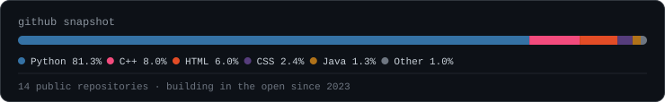

# Hi, I'm Adrian 👋

**Junior Software / AI Developer who'd rather ship a rough prototype than read one more tutorial.**

I build backend systems, ML pipelines, and small tools that solve one problem well —
then push them until they actually work, not just until the demo does.

### 🌐 [Visit my portfolio / landing page →](https://landing-page-phi-one-98.vercel.app/)

 

   junior software / ai developer, ls ./projects -> ipa-builder auto_applyer quant-research, cat motto.txt -> ship it, see what breaks, fix it for real" width="100%" />

 

## What I build

<table>
<tr><td>🧠&nbsp;<strong>AI / ML pipelines</strong></td><td>Forecasting, anomaly detection, and applied research — built with PyTorch and scikit-learn, evaluated honestly</td></tr>
<tr><td>🔁&nbsp;<strong>Automation & tooling</strong></td><td>Python tools that replace repetitive manual work, with real safety rails instead of blind auto-pilot</td></tr>
<tr><td>⚙️&nbsp;<strong>Developer infrastructure</strong></td><td>CI/CD pipelines and small open-source tools that solve exactly one annoying problem</td></tr>
<tr><td>🧪&nbsp;<strong>Applied experiments</strong></td><td>Projects built to answer a specific question — including the ones where the answer wasn't flattering</td></tr>
</table>

 

## Featured projects

<table>
<tr>
<td width="50%" valign="top">

### 🚀 [ipa-builder](https://github.com/adro0303/ipa-builder)

Open-source pipeline that builds unsigned iOS `.ipa` files in the cloud — no Mac, no $99/year Apple Developer account.

**Problem:** testing your own iOS app normally means owning a Mac or paying Apple.
**Built:** a GitHub Actions workflow that spins up a macOS runner to compile any Expo/React Native project, using scoped fine-grained tokens to securely check out a *different* target repo.

`GitHub Actions` `macOS runners` `Bash / YAML` `gh CLI`

**Why it's interesting:** it's pure CI/infrastructure engineering — no app code, just a secure, reusable build pipeline solving a real cost problem.

→ [View project](https://github.com/adro0303/ipa-builder)

</td>
<td width="50%" valign="top">

### 🤖 [auto_applyer](https://github.com/adro0303/auto_applyer)

Local-first Python tool that automates job-outreach *without* turning into a spam bot.

**Problem:** manual outreach doesn't scale, but full automation is how you burn your reputation.
**Built:** a CLI + Streamlit dashboard covering lead import, draft generation, manual approval, dry-run checks, rate-limited SMTP sending, and delivery reports.

`Python` `Streamlit` `SMTP` `CLI design`

**Why it's interesting:** live sending requires `AUTO_SEND_ENABLED=true` *and* typing `SEND LIVE` — product thinking applied to a personal scripting problem.

→ [View project](https://github.com/adro0303/auto_applyer)

</td>
</tr>
<tr>
<td width="50%" valign="top">

### 📈 Quant research — [macro news forecasting](https://github.com/adro0303/macro-news-market-forecasting) · [mandate investor profiling](https://github.com/adro0303/mandate-investor-profiling-fyp)

Two-part BSc final year project: can daily macro news predict next-day ETF returns, and can investor "mandates" (not just a risk score) drive better portfolio allocation?

**Built:** a PyTorch MLP vs. 5 classical baselines under strict walk-forward validation for the forecasting side; a Random Forest mandate predictor feeding a regime-aware, backtested ETF allocator on the portfolio side.

`Python` `PyTorch` `scikit-learn` `pandas`

**Why it's interesting:** both repos report the results that *didn't* work too — e.g. the Markowitz baseline beating the mandate strategy on Sharpe — instead of only showing wins.

→ [Forecasting](https://github.com/adro0303/macro-news-market-forecasting) · [Portfolio allocation](https://github.com/adro0303/mandate-investor-profiling-fyp)

</td>
<td width="50%" valign="top">

### 🔐 [AI-LogAnomalyDetectionSystem](https://github.com/adro0303/AI-LogAnomalyDetectionSystem)

Unsupervised anomaly detection over OpenSSH logs — flagging suspicious activity without labeled attack data.

**Problem:** in security logs, "normal" vastly outweighs "attack," and clean labels rarely exist.
**Built:** a config-driven pipeline (Isolation Forest, LOF, One-Class SVM) with temporal feature engineering, weak-label heuristics for evaluation, and PR-AUC/Recall@K as proxy metrics.

`Python` `scikit-learn` `Docker` `pytest` `GitHub Actions`

**Why it's interesting:** forces careful evaluation design when ground truth barely exists — accuracy alone would be meaningless here.

→ [View project](https://github.com/adro0303/AI-LogAnomalyDetectionSystem)

</td>
</tr>
</table>

 

## Currently building

- 🔧 Actively iterating on **[ipa-builder](https://github.com/adro0303/ipa-builder)** — my most recently pushed project, open source and open to issues/PRs
- 📊 Working through the next steps I flagged myself in the FYP repos — time-series cross-validation and better regime coverage for the portfolio backtests
- 🧰 Looking for the next small, annoying manual task worth turning into a tool — that's how `auto_applyer` started

 

## Tech stack

**Languages**

**AI / Machine Learning**

**Backend, automation & tooling**

**CI/CD & DevOps**

**Primary focus:** Python, PyTorch/scikit-learn, GitHub Actions · **Also used, smaller/earlier projects:** JavaScript, Java, C++, HTML/CSS

 

## Engineering mindset

- Prototype first, read the docs when it breaks — not before
- One command that runs the whole pipeline beats ten manual steps in a README
- Walk-forward validation isn't optional when the whole point is "did this actually generalize"
- If a project of mine has a `Limitations` section, I probably wrote it myself before anyone had to ask

 

## GitHub activity

  

 

## Let's connect

Open to junior backend, AI/ML, and Python engineering roles — and always up for talking about a weird technical idea.

 

 
<i>you scrolled this far — here's some ascii plasma 🌀</i>

